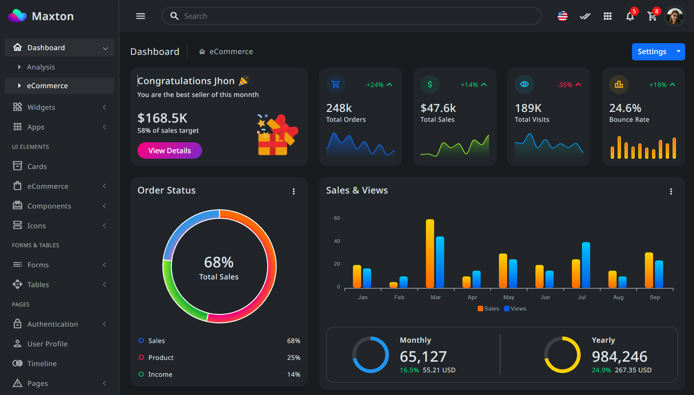

# 🏫 School Management


A Node.js-based application designed to simplify and automate school administrative tasks such as managing students, teachers, classes, attendance, and more.

# 📚 Table of Contents

- [Features](https://www.youtube.com/)
- [Tech Stack](https://www.youtube.com/)
- [Installation](https://www.youtube.com/)
- [Usage](https://www.youtube.com/)
- [API Endpoints](https://www.youtube.com/)
- [Environment Variables](https://www.youtube.com/)
- [Scripts](https://www.youtube.com/)
- [Contributing](https://www.youtube.com/)
- [Contributors](https://www.Contributingyoutube.com/)
- [License](https://www.youtube.com/)

# ✨ Feature

 
- Student & Teacher Management
- Class & Subject Assignment
- Attendance Tracking
- Exam Results
- User Authentication (JWT)
- Admin Dashboard

# 🛠 Tech Stack

- **Programming Language:** JavaScript (Node.js)
- **Runtime** : Express.js
- **Framework** : MongoDB / Mongoose (or MySQL / Sequelize)
- **Database** : JSON Web Token (JWT)
- **Authentication** :dotenv
- **Testing:** Jest / Mocha (optional)


# 🚀 Installation

Clone the project and install dependencies:

```
git clone https://github.com/your-username/school-management-system.git
```
```
cd school-management-system
```
```
npm install
```

## Screenshot



# 🔧 Usage

To run the server in development mode:
```
npm run dev
```
To start the server normally:
```
npm start
```
Access the API at
```
http://localhost:3000/api
```

# 📮 API Endpoints

| Mwthod | Endpoint| Description |
|--------|---------|-------------|
| POST   | /api/auth/login| Login to system| 12345 |
| GET    | /api/students|Login to system |
| POST  |/api/students| Login to system| 12345 |
| PUT   | /api/students/:id	|Login to system |
|DELETE   | /api/tudents/:id|Login to system |

# 🔑 Environment Variables

```
PORT=3000
DB_URI=your_database_connection_string
JWT_SECRET=your_jwt_secret_key
```

# 🧪 Scripts

```
npm start       # Start the server
npm run dev     # Start with nodemon
npm test        # Run test cases
```
# 👥 Contributors


# 📄 License

This project is licensed under the MIT License. See the LICENSE file for more details.

```
---
Let me know:
- if your project uses MongoDB or MySQL (so I can adjust that part),
- if you want to include screenshots or setup diagrams,
- or if you'd like this saved as a downloadable `.md` file.

```